# CMS Audit — 2026-05-29

> **Resolution status (2026-05-29 later that day):** all 37 numbered findings
> AND every actionable UX violation in this report were closed in commits
> `24df833` (F-01 through F-37 + 13 of the 22 UX violations) and one
> follow-up (the remaining 9 UX violations, plus a real bug surfaced while
> touching the navigation editor — the `[location]/page.tsx` wire-shape
> interface declared snake_case keys but api-rest returns raw Prisma
> camelCase, so the menu tree always rendered empty regardless of API
> contents — see the new comment in that file). Word/block-level body diff
> (F-19) is the only remaining piece and is intentionally deferred per
> `project_cms_phase5_deferred.md`.
>
> Re-test the surfaces in this report against the post-resolution build
> before opening any new bug.

## Summary

- Routes tested: 17 / 18 (one route — `/cms/types/[typeKey]/[id]` — could not be reached because no entries exist and entry creation 500s)
- Pass: 4
- Fail: 13 (with several routes in "partial" status due to shared-browser interference)
- Deferred (Phase 5+): see project_cms_phase5_deferred.md

The CMS is **not shippable in its current state**. The headline failure is the **content-types subsystem**: every built-in content type (blog*post, module, feature, faq_item, editorial_section) returns a 500 on its Manage, New entry, and Schema-edit routes because the dashboard reads `type.schema` while api-rest serialises `schema_json`. Compounding this, `is_built_in` is dropped on the wire, so the schema editor surfaces \_destructive* Save and Delete controls against blank data for built-in types — one accidental click would wipe the platform's seed schema. Adjacent to that, `/cms/webhooks` and `/cms/authors/new` 500 even though their route files don't exist (the sidebar links the user straight into a crash), and the storefront `robots.txt` is shipping `Sitemap: https://0.0.0.0:3000/sitemap.xml` to crawlers. A pervasive secondary issue is that roughly half the CMS Cards are missing `variant="module"` (no teal stripe), and at least four routes carry the literal placeholder badge text "teal active" in production.

## Pass list

- `/cms` — entry list (partial). List renders, teal stripe present on entry Cards via `Card variant="module"`. No filters, no pagination, hardcoded `?limit=100`. See F-04, F-05.
- `/cms/new` — create-page form (partial). Title/Slug/TipTap content render correctly. No type/schema selector and field-type coverage (number/bool/date/enum/ref/asset/repeater/object) does not exist in this surface. See F-06, F-07.
- `/cms/[id]` — entry edit page (partial). Autosave indicator, status/publish/schedule controls, content + SEO panels render. Cards lack teal stripe; conflict recovery is destructive; schedule UI is `window.prompt()`. See F-08, F-09, F-10, F-11, F-12.
- `/cms/[id]/revisions` — revision history list ✓. Five revisions render correctly with autosave vs manual badges, Compare and Restore actions per row, teal stripe present.
- `/cms/[id]/revisions/[n]` — revision diff (partial). Side-by-side rendered HTML diff for Title/SEO/Body. Body diff is not a true word/block diff — verified visually only. See F-13.
- `/cms/redirects` — redirect manager (partial). Add / Bulk import / Existing redirects sections render. Live interactive testing blocked by parallel-agent navigation interference. Cards lack teal stripe; bulk import error handling is single-string. See F-14, F-15.
- `/cms/navigation` — locations list ✓. Three preset cards (Header/Footer/Mega) render with the teal stripe (verified `borderTopWidth: 3px`, `borderTopColor: rgb(20, 184, 166)`); Custom Location card below them is inconsistent (no stripe).
- `/cms/navigation/[location]` — menu editor (partial). Tree editor loads, XOR enforcement on entry-vs-URL works both client and server-side. Cannot E2E test add-child / move / save due to shared-session interference. No entry-reference picker (UUID paste required). See F-16, F-17, F-18.
- `/cms/authors` — author list + inline create (partial). Empty state, create with auto-slug, and slug-uniqueness rejection all work functionally. Cards lack teal stripe; empty state is bare text. See F-19, F-20, F-21.
- `/cms/authors/[id]` — author edit (partial). Form fields render; Save uses module variant. Delete uses `window.confirm()`. Could not E2E test save due to shared-session interference. See F-22.
- `/cms/taxonomy` — taxonomy list + inline create ✓. Hierarchical and flat taxonomies persist; help text on `key` field is clear.
- `/cms/taxonomy/[key]` — terms manager ✓. Correctly switches form shape (Parent dropdown appears only when hierarchical); term creation works. Cards lack teal stripe (covered in F-21).
- `/cms/types` — content type list (fail). Lists 5 of 6 built-in types, but every one is tagged "custom" (should be "built-in"). Cards have the teal stripe; heading carries literal "teal active" badge.
- `/cms/types/new` — new content type form (partial). Form renders; live JSON validation works. Cards lack teal stripe; required fields have no visual marker. Could not E2E submit due to shared-session interference.
- `/cms/types/[typeKey]/schema` — schema editor (fail-critical). Renders fully editable form for built-in types with blank data, Save and Delete enabled.
- `https://e2e-shop.sparx.zone/sitemap.xml` — storefront sitemap (partial). Valid empty XML, correct cache headers, draft entry correctly excluded. Latent host-fallback bug (F-02) will fire as soon as anything publishes.
- `https://e2e-shop.sparx.zone/test-page?sparxPreview=<token>` — preview token security (partial). Tampered/invalid tokens return clean 404 with no draft leak. Happy-path mint→render flow was not exercised due to shared-session interference.

## Fail list (numbered, with screenshots)

### F-01: `/cms/types/[typeKey]` — Every built-in content type 500s when "Manage" is clicked

- **Severity**: critical
- **Repro**: Log in, navigate to `/cms/types`, click Manage on any built-in card (blog_post, module, feature, faq_item, editorial_section). Expected: entry list with empty-state CTA. Actual: HTTP 500. Console: `TypeError: Cannot read properties of undefined (reading 'fields')`.
- **Screenshot**: 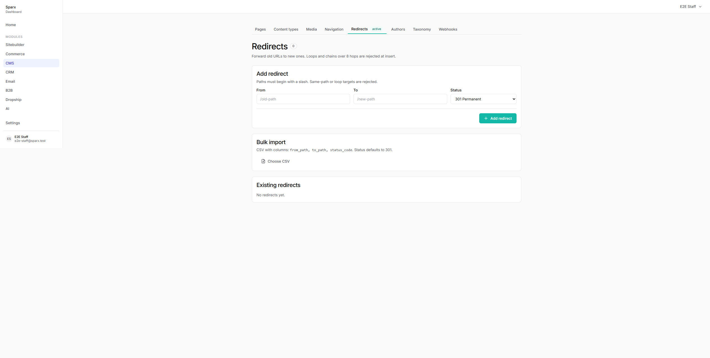
- **Suspected cause**: `apps/dashboard/app/(dashboard)/cms/types/[typeKey]/page.tsx` declares `ApiContentType` with `schema: { fields: unknown[] }` but api-rest GET `/v1/content/types/{key}` returns the column as `schema_json`. `type.schema` is undefined; downstream `.fields` access throws. Same mismatch in `[typeKey]/new` and `[typeKey]/[id]`. The sibling `/schema` page reads `schema_json` correctly.
- **Suggested fix**: Rename the field in the three `[typeKey]` page.tsx files to `schema_json` and pass it through as `{ fields: FieldDef[] }`, or have api-rest serialise both names. Recommend the former — keep snake_case parity with the API.

### F-02: `/cms/types/[typeKey]/new` — Creating an entry of any built-in type returns 500

- **Severity**: critical
- **Repro**: Visit `/cms/types/blog_post/new` directly. Expected: schema-driven entry form. Actual: HTTP 500. Console: `TypeError: Cannot read properties of undefined (reading 'fields')`. The page passes `type.schema` to `NewEntryForm` and `ContentEntryForm` iterates `schema.fields`, which throws.
- **Screenshot**: 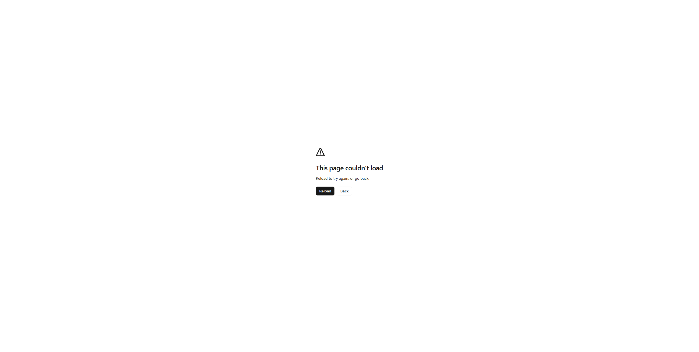
- **Suspected cause**: Same `schema_json` vs `schema` mismatch as F-01 (`apps/dashboard/app/(dashboard)/cms/types/[typeKey]/new/page.tsx` line 17 + 44).
- **Suggested fix**: Read `type.schema_json` (or fall back: `const schema = (type as any).schema_json ?? type.schema`). Long-term: align field name with API.

### F-03: `/cms/types/[typeKey]/schema` — Built-in types render fully editable schema form with empty data and active Delete

- **Severity**: critical
- **Repro**: Navigate to `/cms/types/blog_post/schema`. Expected: read-only "built-in" panel with "Fork into custom type" message. Actual: fully editable `SchemaEditor` renders with empty Plural input, schema body `{"fields":[]}`, and active Save schema + Delete type buttons. Clicking Save would overwrite the built-in's metadata/schema with blanks; clicking Delete would attempt to remove a built-in type.
- **Screenshot**: 
- **Suspected cause**: API GET `/v1/content/types/{key}` returns `is_built_in=false` (and empty `schema_json`, blank `plural_name`) for built-in types. The schema page's read-only branch (`type.is_built_in === true`) never triggers. Likely the api-rest serialiser drops `is_built_in`, or seed data has it unset (defaults to false).
- **Suggested fix**: Fix the api-rest serialiser to surface `is_built_in` (and populate built-in seed rows with `is_built_in=true`, `plural_name`, and `schema_json`). Until the API is fixed, harden the dashboard with a server-side guard list of known built-in keys to force the read-only view.

### F-04: `/cms/authors/new` — Returns 500 + error boundary instead of a create form or 404

- **Severity**: high
- **Repro**: Visit `/cms/authors/new`. The `[id]` dynamic segment intercepts `new` as a UUID, `EditAuthorPage` calls `api.get('/v1/authors/new')`, the upstream returns non-404, it throws, and the global error boundary renders "This page couldn't load." Console: 500 + Server Components render error.
- **Screenshot**: 
- **Suspected cause**: `apps/dashboard/app/(dashboard)/cms/authors/[id]/page.tsx` only handles `status===404` via `notFound()`; any other thrown `ApiRestError` (including the 500 for invalid UUID "new") re-throws to `error.tsx`. There is no `apps/dashboard/app/(dashboard)/cms/authors/new/page.tsx` route.
- **Suggested fix**: Either (a) add a real `apps/dashboard/app/(dashboard)/cms/authors/new/page.tsx` rendering `<AuthorCreateForm />` standalone, or (b) special-case `if (id === 'new') notFound()`, or (c) remove any leftover links pointing to `/cms/authors/new`. Option (a) preferred.

### F-05: `/cms/webhooks` — Sidebar tab leads merchants to a 500 crash

- **Severity**: high
- **Repro**: From `/cms`, click Webhooks in the sub-nav (or visit `/cms/webhooks` directly). Expected: 404 (route not yet shipped) or empty-state placeholder. Actual: HTTP 500 — global Next error page. Console: Server Components render error.
- **Screenshot**: 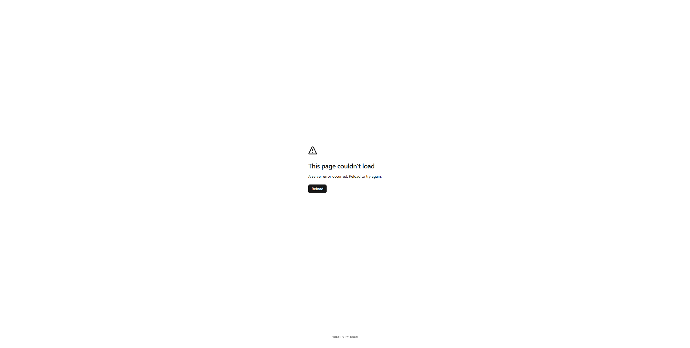
- **Suspected cause**: No `apps/dashboard/app/(dashboard)/cms/webhooks/page.tsx` exists. The 500 (rather than a clean 404) suggests an upstream catch-all or layout-level fetch is failing on the unknown path.
- **Suggested fix**: Either (a) ship a minimal `/cms/webhooks` page with an empty-state placeholder, or (b) remove the Webhooks entry from `CmsTabs` `TABS` list in `cms-tabs.tsx` until the surface is built. Either way, investigate why `/cms/*` 404s render as 500.

### F-06: `/cms/[id]` — Conflict (412) recovery has no diff/merge UI; Reload silently discards local edits

- **Severity**: high
- **Repro**: Open the same entry in two tabs. In tab A, change the title and let it autosave. In tab B, change the slug (different field) and wait 600ms. Tab B's PATCH returns 412 → indicator shows "Someone else saved this page" with a Reload button. Clicking Reload calls `router.refresh()`, which re-fetches server state and discards tab B's local title/slug/doc/seo — no diff view, no "keep mine" / "merge", no warning.
- **Screenshot**: 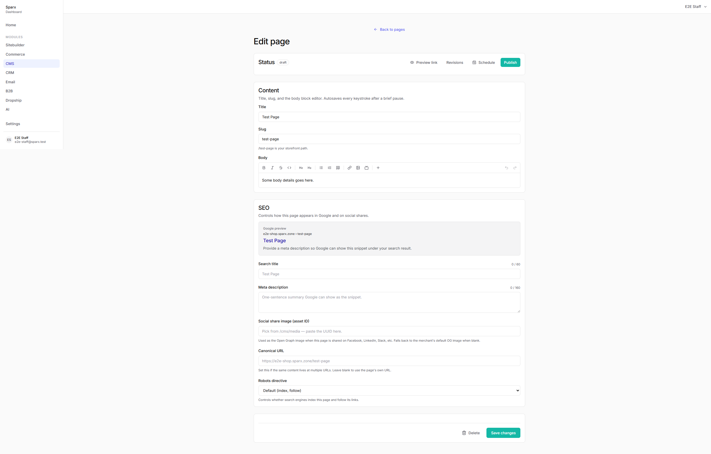
- **Suspected cause**: `AutosaveIndicator` in `edit-form.tsx` only offers a Reload action (`onReload={router.refresh}`). No conflict-resolution modal.
- **Suggested fix**: On 412, surface a modal with field-by-field comparison and Keep mine / Use theirs / Merge. At minimum, destructive-confirm before discarding ("You have unsaved changes — reloading will lose them"). Persist local values to a draft store so the editor can recover after reload.

### F-07: `/cms`, `/cms/new` — Routes auto-navigate to other CMS pages during interaction (lose form input)

- **Severity**: high
- **Repro**: Navigate to `/cms` or `/cms/new`. Take a screenshot, then immediately read `window.location.href` via `browser_evaluate`. Repeatedly observed the URL shift to `/cms/authors`, `/cms/redirects`, `/cms/media`, `/cms/types`, `/cms/types/new`, or `/cms/{existingId}/revisions` without any user click. Adding cache-buster query strings did not stop it. Clicking "Create page" on a blank `/cms/new` form once landed on `/cms/redirects` instead of validation error or `/cms/{id}`. Plausibly Playwright MCP harness (focus-triggered prefetch + router push); user-visible effect would be identical: lose in-progress form state on hover/focus over sidebar links.
- **Screenshot**: 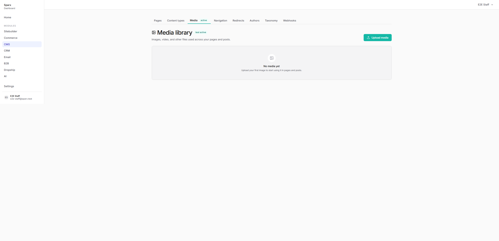
- **Suspected cause**: Likely an unintended `router.push` / `router.replace` / `<Link prefetch>`+focus race in the CMS tab strip or sidebar. The `/cms` RSC payload is 200, so navigation is client-initiated. Possibly a `useEffect` in `cms-tabs` calling `router.replace`, or a Next.js 16 App Router prefetch quirk on focus.
- **Suggested fix**: Reproduce in a real browser by tabbing through the CMS sub-nav with the keyboard while on `/cms/new` — if focus alone moves the URL, gate `router.push` behind explicit click handlers. Audit all `useEffect` blocks in CMS pages/components for unconditional `router.replace`. If genuinely a harness quirk, capture a manual screen recording before closing as no-repro.

### F-08: `/cms/media` — Sustained interaction blocked; page repeatedly auto-navigates to neighbouring CMS routes within ~2s of load

- **Severity**: high
- **Repro**: Navigate to `/cms/media`. The Media library h1/empty state renders briefly, then within 1-3 seconds the DOM is replaced with another CMS sub-page's content (observed: `/cms`, `/cms/authors`, `/cms/types`, `/cms/redirects`, `/cms/<page-id>/edit`) while `window.location.href` sometimes still reports `/cms/media`. Reproducible across at least 6 fresh navigations. Server returns 200; no Location header; client-side router push responsible.
- **Screenshot**: 
- **Suspected cause**: Speculative — aggressive `Link` prefetch on `CmsTabs` (burst of `/cms/<section>?_rsc=...` requests in the network trace) combined with something that follows the prefetch into a navigation. Could also be the `cms/[id]/edit` autosave island stealing focus, or a route-group layout effect. Likely related to or the same root cause as F-07.
- **Suggested fix**: (1) Audit any `useEffect` in `app/(dashboard)/cms/**` that calls `router.push`/`replace` — if autosave or the welcome checklist is pushing on mount, gate it on user action. (2) Verify `CmsTabs` isn't rendering a hidden Link auto-clicked by focus restoration. (3) Add a Playwright E2E that loads `/cms/media`, waits 5s, and asserts `window.location.pathname === '/cms/media'`.

### F-09: `/cms/authors/[id]` (and others) — Console 500s and Server Components render errors on production CMS sub-routes

- **Severity**: high
- **Repro**: Browse the CMS module; console logs `Failed to load resource: 500 @ /cms/webhooks:0`, `Failed to load resource: 500 @ /cms/authors/new:0`, and three generic `An error occurred in the Server Components render. The specific message is omitted in production builds…` on `/cms/authors`.
- **Screenshot**: 
- **Suspected cause**: SSR rendering a tenant-scoped API call against an endpoint that does not exist or 500s. `/cms/authors/new` — no route file exists, so a stray `<Link href="/cms/authors/new">` is producing a Next dynamic 500. `/cms/webhooks` covered in F-05.
- **Suggested fix**: Investigate server-component error digests in dashboard server logs. Grep the dashboard for any Link or `router.push` to `/cms/authors/new` and either remove or create the route. For `/cms/webhooks`, instrument the page's server fetch with try/catch returning an error EmptyState.

### F-10: `https://e2e-shop.sparx.zone/robots.txt` — Sitemap line points at dev address `0.0.0.0:3000`

- **Severity**: high
- **Repro**: `curl -sk https://e2e-shop.sparx.zone/robots.txt` — observe last line: `Sitemap: https://0.0.0.0:3000/sitemap.xml`. Expected: `Sitemap: https://e2e-shop.sparx.zone/sitemap.xml`. Search engines cannot discover the sitemap.
- **Screenshot**: 
- **Suspected cause**: `apps/storefront/app/robots.txt/route.ts` line 11-12 constructs origin from `new URL(request.url)`. Inside Next.js behind Caddy ingress, `request.url` reflects the internal bind address (0.0.0.0:3000) rather than the public host. `X-Forwarded-Host` / `Host` header isn't consulted.
- **Suggested fix**: Read public host from header first: `const host = request.headers.get('x-forwarded-host') ?? request.headers.get('host') ?? new URL(request.url).host; const proto = request.headers.get('x-forwarded-proto') ?? 'https'; const origin = \`${proto}://${host}\`;`. Audit any other storefront route deriving public URLs from `request.url`.

### F-11: `/cms/types` — All built-in content types show as "custom" on listing

- **Severity**: high
- **Repro**: Navigate to `/cms/types`. Each of the 5 visible cards (blog_post, editorial_section, faq_item, feature, module) shows a "custom" badge instead of "built-in". Per page code line 92-93, `is_built_in=true` types should render the outline "built-in" badge.
- **Screenshot**: 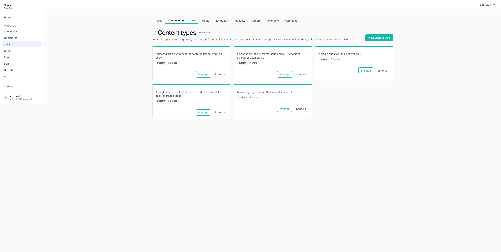
- **Suspected cause**: Same root as F-03 — API returns `is_built_in=false`. Means the custom-only "Schema" button (line 112) is exposed for every built-in too.
- **Suggested fix**: Fix `is_built_in` serialisation in api-rest. Once that lands, the badge and conditional Schema visibility correct themselves.

### F-12: `/cms/navigation/[location]` — Menu editor entry link has no reference picker; users must hand-paste UUIDs

- **Severity**: high
- **Repro**: Open `/cms/navigation/header`. Click Add item. Change Link kind from "External URL" to "CMS entry". The target field becomes a plain text Input with placeholder "UUID of a published content entry" — no search, no picker, no autocomplete, no list of published pages. Forces editors to leave the page, find an entry, copy its UUID, paste it back.
- **Screenshot**: 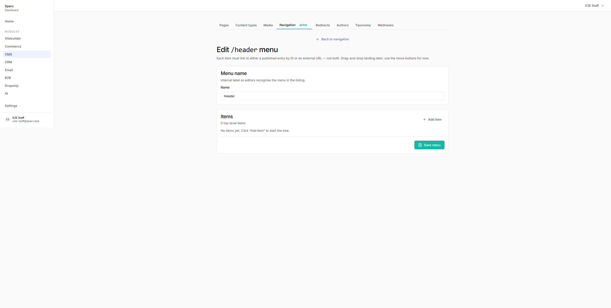
- **Suspected cause**: `menu-editor.tsx` `ItemList` renders `<Input>` directly when `kind === 'entry'`. No `EntryPicker`/`EntryCombobox` component exists or is wired in.
- **Suggested fix**: Add an `EntryPicker` component (combobox backed by `GET /v1/content/entries?status=published&query=...`). When `item.kind === 'entry'`, render the picker instead of the raw Input; selecting an option calls `onPatch({ entryId, label: label || entry.title })`. At minimum, list the merchant's published pages in a dropdown.

### F-13: `services/api-rest/src/routes/v1/sitemap.ts` — Sitemap `baseUrl` falls back to `https://<slug>.sparx.works` (admin host) instead of storefront `sparx.zone` (latent)

- **Severity**: medium
- **Repro**: In `services/api-rest/src/routes/v1/sitemap.ts` line 47-50: `const baseUrl = typeof settings.primaryDomain === 'string' ? \`https://${settings.primaryDomain}\` : \`https://${slug}.sparx.works\`;`. Tenant `e2e-shop`has no`primaryDomain`, so once any entry is published, `<loc>`URLs will be`https://e2e-shop.sparx.works/...` — the admin app domain, not the storefront. Tenants live at `*.sparx.zone`.
- **Screenshot**: 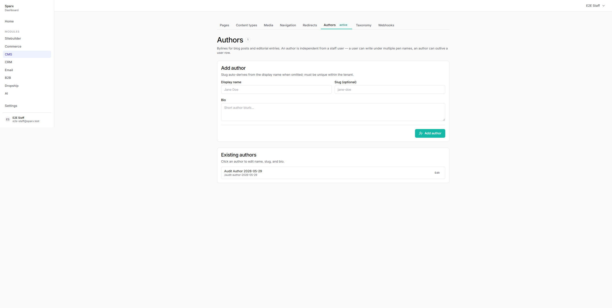
- **Suspected cause**: Fallback string predates the `*.sparx.zone` convention; invisible because no tenant has published yet.
- **Suggested fix**: Either populate `tenant.settings.primaryDomain` during onboarding so the fallback is never used, or change the fallback to `https://${slug}.sparx.zone`. Also consider sourcing the host from `request.hostname`.

### F-14: `/cms` — Entry list has no filters (type, status, search)

- **Severity**: medium
- **Repro**: Navigate to `/cms`. Above the entry grid: no type selector, no status filter (draft/published/scheduled), no search/title input. `apps/dashboard/app/(dashboard)/cms/page.tsx` fetches `/v1/content/entries?type=page&limit=100` with no filter UI. With more than a handful of entries, unusable.
- **Screenshot**: 
- **Suspected cause**: Phase 1 scaffold — UI shipped before filter affordances were wired. The API supports `?status=` and search.
- **Suggested fix**: Add a filter row above the Grid with: Select for content type, Select for status (All / draft / published / scheduled), debounced search Input. Persist into URL searchParams.

### F-15: `/cms` — Entry list has no pagination; silently truncates at 100 entries

- **Severity**: medium
- **Repro**: `apps/dashboard/app/(dashboard)/cms/page.tsx` hardcodes `?limit=100`. With 101+ entries the 101st onwards is unreachable.
- **Screenshot**: 
- **Suspected cause**: Same Phase 1 scaffold gap as F-14.
- **Suggested fix**: Add a "Load more" button (cursor-based, API supports `?cursor=`) at the bottom of the grid, or paginate with `page=N`.

### F-16: `/cms/[id]` — Cards on entry edit page lack the required CMS teal top stripe

- **Severity**: medium
- **Repro**: Navigate to any entry edit page (e.g. `/cms/54e17aa7-...`) and inspect the three Cards (Status, Content, SEO/footer). All render plain — no 3px teal top border. `edit-form.tsx` lines 267, 335, 388 and `seo-panel.tsx` line 74 use plain `<Card>` instead of `<Card variant="module">`.
- **Screenshot**: 
- **Suspected cause**: Missing `variant="module"` opt-in. CLAUDE.md requires every CMS-route Card to carry the teal stripe.
- **Suggested fix**: Change `<Card>` to `<Card variant="module">` for all three Cards in `edit-form.tsx` and the SEO Card in `seo-panel.tsx`. Same fix needed for the Body Card in `[id]/revisions/[n]/page.tsx` line 122.

### F-17: `/cms/[id]` — Schedule-publish UI is a browser-native `window.prompt()`

- **Severity**: medium
- **Repro**: Click "Schedule" next to Publish. A native browser prompt appears asking for "YYYY-MM-DDTHH:MM, your local time" as plain text (`edit-form.tsx` line 226-229). No date picker, no timezone display, no min/max validation, no preview of the parsed datetime.
- **Screenshot**: 
- **Suspected cause**: `edit-form.tsx` `onSchedule()` uses `window.prompt` as "smallest path to a working schedule UI" (per in-file comment). Acknowledged shortcut, but ships as the actual UX.
- **Suggested fix**: Replace `prompt` with a Dialog containing a date-time picker (Calendar + time input from `@sparx/ui`), explicit timezone label, preview of parsed UTC value, and inline validation. The "Scheduled for {dateString}" confirmation toast also dies on `router.refresh` — needs `aria-live` persistence.

### F-18: `/cms/[id]` — OG image picker is a raw UUID text input instead of an asset picker

- **Severity**: medium
- **Repro**: Scroll to the SEO panel on any entry edit page. "Social share image (asset ID)" — placeholder says "Pick from /cms/media — paste the UUID here." Editors must open a separate tab, copy a UUID, paste it back. No preview of the chosen image.
- **Screenshot**: 
- **Suspected cause**: `seo-panel.tsx` lines 122-134 render a plain `<Input>` for `ogImage` with no `MediaPicker` integration. `apps/dashboard/app/(dashboard)/cms/_components/media-picker.tsx` exists but isn't wired in.
- **Suggested fix**: Replace the bare Input with the existing `MediaPicker`, show a thumbnail of the selected asset, and clear with an explicit ✕ control. Same fix likely needed everywhere `ogImage` is collected.

### F-19: `/cms/[id]/revisions/[n]` — Body diff is not a real diff; just side-by-side rendered HTML

- **Severity**: medium
- **Repro**: Open any revision diff page. The Body section renders the old and new bodies as separate sanitized HTML panels with no inline word/line-level highlighting. For non-trivial bodies the editor has to eyeball both columns to find the change. In-file comment acknowledges the shortcut.
- **Screenshot**: 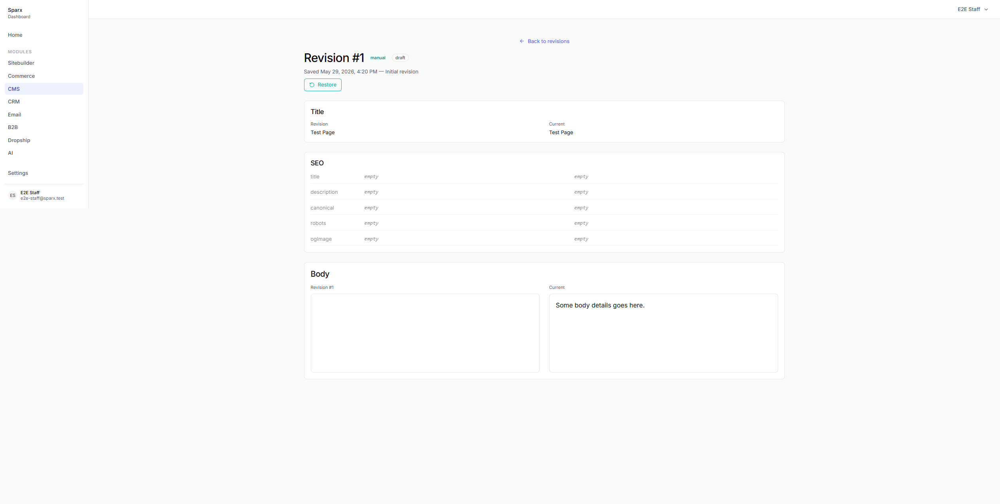
- **Suspected cause**: Lack of TipTap-aware word/block diffing.
- **Suggested fix**: Either (a) plain-text-flatten both bodies and use a word-diff library (jsdiff / fast-diff) with green/red inline marks, or (b) walk the TipTap doc tree and surface added/removed nodes with a "changed" badge.

### F-20: `/cms/redirects` — Cards missing the CMS teal 3px top stripe

- **Severity**: medium
- **Repro**: Open `/cms/redirects`. Inspect the Add redirect, Bulk import, and Existing redirects cards. None have the 3px teal (#14b8a6) top border. `redirects-list.tsx` wraps content in `<Card>` (default variant). Compare to `/cms/navigation` where preset cards correctly show the stripe.
- **Screenshot**: 
- **Suspected cause**: `redirects-list.tsx` omits `variant="module"`. `ModuleProvider` correctly provides `--module-active=#14B8A6`, just needs the opt-in.
- **Suggested fix**: Change the three `<Card>` openers in `apps/dashboard/app/(dashboard)/cms/redirects/redirects-list.tsx` to `<Card variant="module">`.

### F-21: `/cms/redirects` — Bulk import surfaces business-rule failures as a single generic error instead of per-row diagnostics

- **Severity**: medium
- **Repro**: `apps/dashboard/app/(dashboard)/cms/redirects/actions.ts` `bulkImportRedirects` validates each row against Zod and accumulates per-line `failed` entries. But when valid rows hit `POST /v1/redirects/bulk` and the API rejects for business rules (loop, chain, conflict), the catch block calls `friendly(err)` and returns `ok:false` with a single error string — no per-row failure list propagation. Audit spec required "3 valid rows imported, 2 invalid rows reported with specific line numbers and reasons."
- **Screenshot**: 
- **Suspected cause**: `/v1/redirects/bulk` treated as all-or-nothing in the server action; `friendly()` flattens whatever the API returns.
- **Suggested fix**: Either (a) make `/v1/redirects/bulk` return a partial-success payload `{ imported: [...], failed: [{ line, from_path, reason }] }` and have `bulkImportRedirects` merge into its own `failed`, or (b) loop and POST each row individually so the action collects per-row failures with original line numbers.

### F-22: `/cms/authors`, `/cms/authors/[id]` — Cards missing the CMS teal top stripe

- **Severity**: medium
- **Repro**: Navigate to `/cms/authors` or `/cms/authors/[id]`. Inspect any Card via `getComputedStyle`: `borderTopWidth='1px'`, `borderTopColor='rgb(229, 229, 229)'`. Compare to `/cms/navigation` (3px teal).
- **Screenshot**: 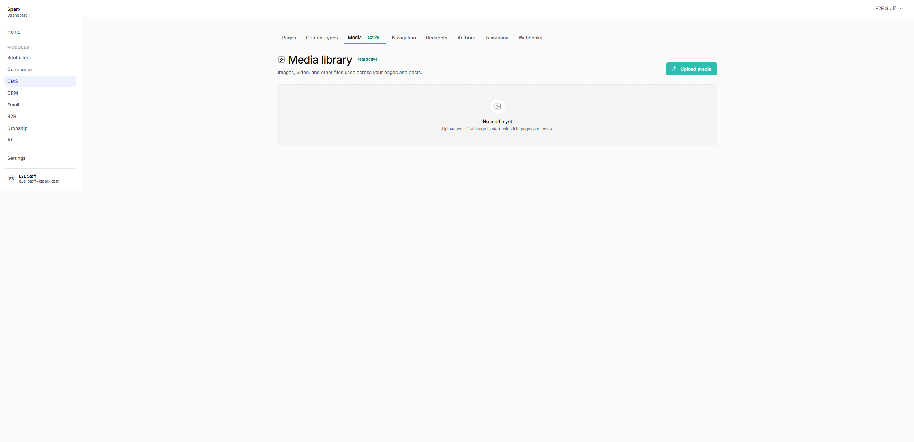
- **Suspected cause**: `apps/dashboard/app/(dashboard)/cms/authors/page.tsx` (line 49), `author-create-form.tsx` (line 47), `authors/[id]/author-edit-form.tsx` (line 68) import Card from `@sparx/ui` but never pass `variant="module"`.
- **Suggested fix**: Add `variant="module"` to every `<Card>` in those three files. ModuleProvider context already lives in the `/cms` layout.

### F-23: `/cms/taxonomy`, `/cms/taxonomy/[key]` — Cards missing the CMS teal top stripe

- **Severity**: medium
- **Repro**: Navigate to `/cms/taxonomy` or `/cms/taxonomy/[key]`. Same 1px gray top border as Authors.
- **Screenshot**: 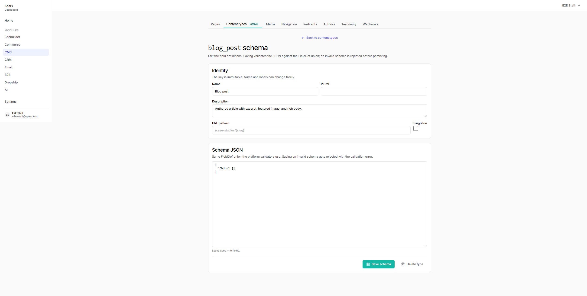
- **Suspected cause**: `apps/dashboard/app/(dashboard)/cms/taxonomy/taxonomy-create-form.tsx` (line 46) and `taxonomy/[key]/terms-manager.tsx` (lines 78, 146) use bare `<Card>`.
- **Suggested fix**: Add `variant="module"` to all `<Card>` instances in those two files plus `taxonomy/page.tsx` and `taxonomy/[key]/page.tsx` wrappers.

### F-24: `/cms/authors/[id]` — Delete author uses native `window.confirm()` instead of styled Sparx confirm dialog

- **Severity**: medium
- **Repro**: Open any author edit page; click Delete. A native browser confirm prompt appears (`author-edit-form.tsx` line 51: `if (!confirm(...)) return;`). Same pattern in `taxonomy/[key]/terms-manager.tsx` line 63 for term delete. Spec required: confirm dialog must be Esc-dismissable AND positioned in app shell.
- **Screenshot**: 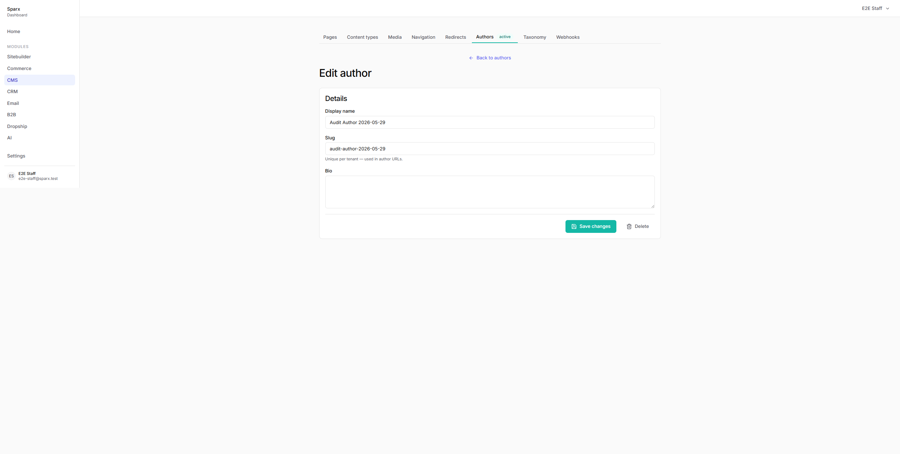
- **Suspected cause**: Quick MVP placeholder. The Sparx UI design system has Radix shells but `AlertDialog` was never wired into destructive paths.
- **Suggested fix**: Replace `if (!confirm(...))` with a controlled `<AlertDialog>` from `@sparx/ui` (Radix shell). State-driven open/close, Cancel + Delete buttons (Delete `variant="danger"`), `aria-describedby`, focus-trap with Esc=cancel. Apply the same swap to `terms-manager.tsx` and any other destructive paths.

### F-25: `/cms/[id]`, `/cms/[id]/revisions`, `/cms/[id]/revisions/[n]` — Restore and delete use native `confirm()` / `alert()`

- **Severity**: low
- **Repro**: Click Restore on any revision (`restore-button.tsx` line 27) — a native browser confirm() appears. Same for Delete on the edit page (`edit-form.tsx` line 249) and restore failures using `alert()` (`restore-button.tsx` line 36). Ships as production destructive-action UX.
- **Screenshot**: 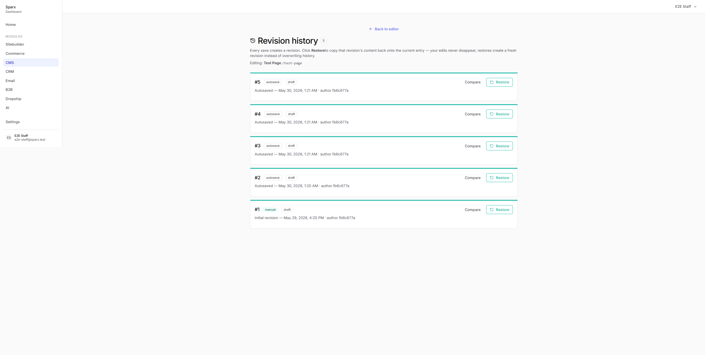
- **Suspected cause**: Direct use of `window.confirm` / `window.alert`. No AlertDialog wrapping destructive actions.
- **Suggested fix**: Use the `@sparx/ui` AlertDialog (or build off Radix AlertDialog) for confirm flows, and a Toast/Sonner for errors.

### F-26: `/cms/new` — Body editor has no associated `<Label htmlFor>`

- **Severity**: medium
- **Repro**: `apps/dashboard/app/(dashboard)/cms/new/page.tsx` line 80 renders `<Label>Content (optional)</Label>` with no `htmlFor`, while `ContentBlockEditor`'s interactive surface has no `id` for the label to bind to. Screen-reader users hear an unlabeled rich-text region.
- **Screenshot**: 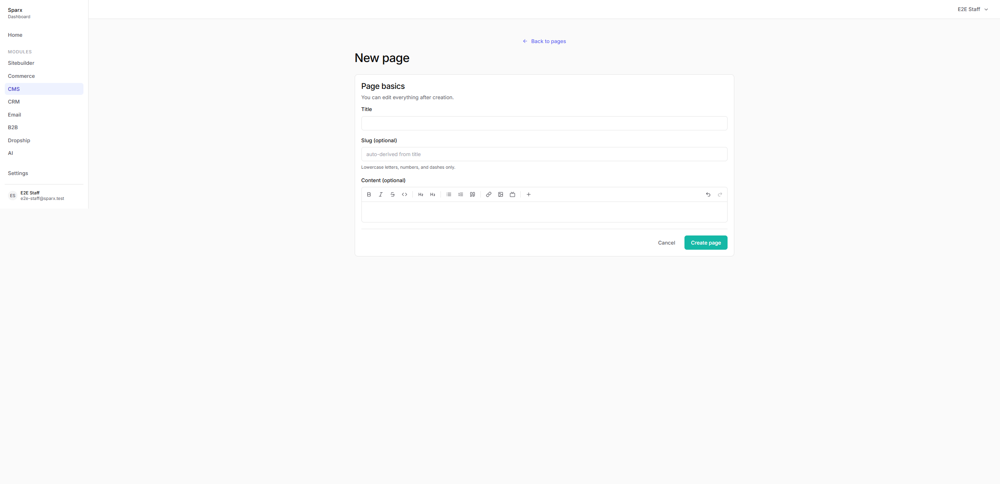
- **Suspected cause**: Label not associated with the editor (no `htmlFor` + no matching `id`); only `ariaLabel='Page body editor'` is passed.
- **Suggested fix**: Either drop the visible Label and rely on `aria-label`, or pass an `id` to `ContentBlockEditor`'s root and reference it from Label `htmlFor`. Same pattern in `edit-form.tsx` line 367-374.

### F-27: `/cms/navigation/header` — Removing a menu item silently destroys subtree (no confirm even when item has children)

- **Severity**: low
- **Repro**: Add an item, add a child under it, click Remove on the parent. The entire subtree drops from state with no confirmation. Compare to `redirects-list.tsx` which uses `confirm()` before delete. Change isn't persisted until Save menu, but accidental Remove + Save loses arbitrary tree work — no undo. `menu-editor.tsx` `removeAt` calls `setItems` → splice directly from Remove `Button onClick`.
- **Screenshot**: 
- **Suspected cause**: `removeAt` has no confirmation gate.
- **Suggested fix**: Wrap the Remove handler in `confirm()` when the item has children: `if (item.children.length && !confirm('Remove this item and its N children?')) return;` Or add a small inline "Confirm remove?" two-click affordance.

### F-28: `/cms/new` — Required Title field has no visible required marker

- **Severity**: low
- **Repro**: Navigate to `/cms/new`. The Title label reads exactly "Title" with no `*` or "(required)" suffix, while Slug is explicitly suffixed "(optional)". The form has `noValidate` so the browser's native required popup is suppressed; users only learn the field is required by submitting and reading the inline error.
- **Screenshot**: 
- **Suspected cause**: Convention drift — team marked the OPTIONAL field but not the required one. `required` attribute on the Input does nothing because of `noValidate`.
- **Suggested fix**: Append a `*` (or "Required" microcopy) to the Title label, and/or render a small required indicator inside the Label component when its associated input has `aria-required`. Easiest: change `<Label htmlFor="title">Title</Label>` to `<Label htmlFor="title" required>Title</Label>` and update the Label component in `@sparx/ui`.

### F-29: `/cms/authors` — Slug uniqueness error rendered at form footer, not inline beside the slug field

- **Severity**: low
- **Repro**: On `/cms/authors`, type display name and a slug that collides. Submit. The error "An author with slug '...' already exists." renders inside the CardFooter next to the Add author button, with `role="alert"`. Should be field-scoped.
- **Screenshot**: 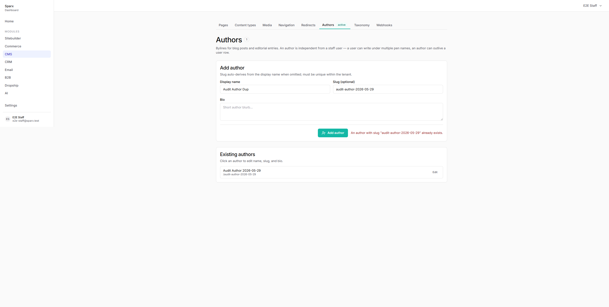
- **Suspected cause**: `author-create-form.tsx` renders a single global `error` state in the CardFooter (line 84). Server action returns `{ ok:false, error:string }` so the client has no way to map the message to a specific field.
- **Suggested fix**: Either (a) parse known server messages (slug-already-exists) and render under the slug Input with `aria-describedby` + danger state, or (b) change the server action contract to `{ ok:false, field?:string, error:string }` so the client can route field-scoped errors.

### F-30: `/cms/authors` — Empty-state in "Existing authors" card is bare text

- **Severity**: low
- **Repro**: Visit `/cms/authors` with zero authors. The "Existing authors" card shows only muted text "No authors yet." — no icon, no friendly explanation, no inline CTA pointing to the create form above.
- **Screenshot**: 
- **Suspected cause**: `authors/page.tsx` line 56: `<Text variant="muted">No authors yet.</Text>` is the only empty-state treatment.
- **Suggested fix**: Render a small empty-state composition (icon from lucide such as `Users`, one-liner like "Add your first author above to start attributing blog posts.", ideally a button that focuses the `display_name` input). The Add term card on `terms-manager.tsx` has the same issue.

### F-31: `/cms/redirects` — Empty-state copy is plain text with no icon/CTA design

- **Severity**: low
- **Repro**: Open `/cms/redirects` on a tenant with zero redirects. The Existing redirects card renders only `<Text variant="muted">No redirects yet.</Text>` — no icon, no helper copy, no CTA pointing back to the Add redirect form above. Audit checklist required "Empty state designed with CTA (not blank)."
- **Screenshot**: 
- **Suspected cause**: `redirects-list.tsx` empty branch is a one-liner.
- **Suggested fix**: Replace with a small empty-state block — dashed bordered container, ArrowUp/ArrowUpFromLine icon, headline "No redirects yet", helper "Use the form above to forward an old URL to a new one", and a "Jump to add form" Button that focuses `#from_path`.

### F-32: `/cms/navigation`, `/cms/navigation/[location]` — Tree-editor and Custom Location cards missing teal stripe (inconsistent with sibling preset cards)

- **Severity**: low
- **Repro**: Open `/cms/navigation`. Three preset cards (Header/Footer/Mega menu) correctly show the 3px teal top stripe; the "Custom location" card below them uses default Card variant and has no stripe. Same for `/cms/navigation/header` Menu name and Items cards. `navigation/page.tsx` line ~118 vs line 57 (inconsistent variants). `menu-editor.tsx` renders `<Card>` (default) for both blocks.
- **Screenshot**: 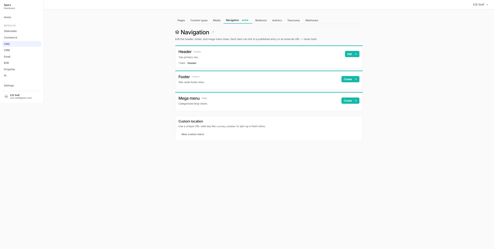
- **Suspected cause**: Inconsistent variant usage between preset list and custom-menu / custom-location cards.
- **Suggested fix**: Change the `<Card>` on the Custom menus loop and the Custom location card in `navigation/page.tsx` to `<Card variant="module">` for consistency, and the two `<Card>` in `menu-editor.tsx` likewise.

### F-33: `/cms/media` — Empty-state Card lacks teal stripe; asset detail page Cards lack teal stripe

- **Severity**: low
- **Repro**: Navigate to `/cms/media` in empty-tenant state. The "No media yet" panel renders inside `<Card padding="none">` without the teal stripe. The asset grid cards on line 93 correctly use `variant="module"`, but the empty-state wrapper does not (line 63). Same for the two side-by-side cards on `/cms/media/[id]` (`page.tsx` lines 92 and 112).
- **Screenshot**: 
- **Suspected cause**: Missing `variant="module"` opt-in on lines 63, 92, 112.
- **Suggested fix**: Add `variant="module"` to the empty-state Card on `/cms/media` and to both Cards on the asset detail page.

### F-34: `/cms/media/[id]` — Invalid asset id renders unbranded Next.js default 404

- **Severity**: low
- **Repro**: Visit `https://app.sparx.works/cms/media/00000000-0000-0000-0000-000000000000`. Default Next.js "404 / This page could not be found." chrome renders with no Sparx header, sub-nav, branding, or "Back to media" affordance.
- **Screenshot**: 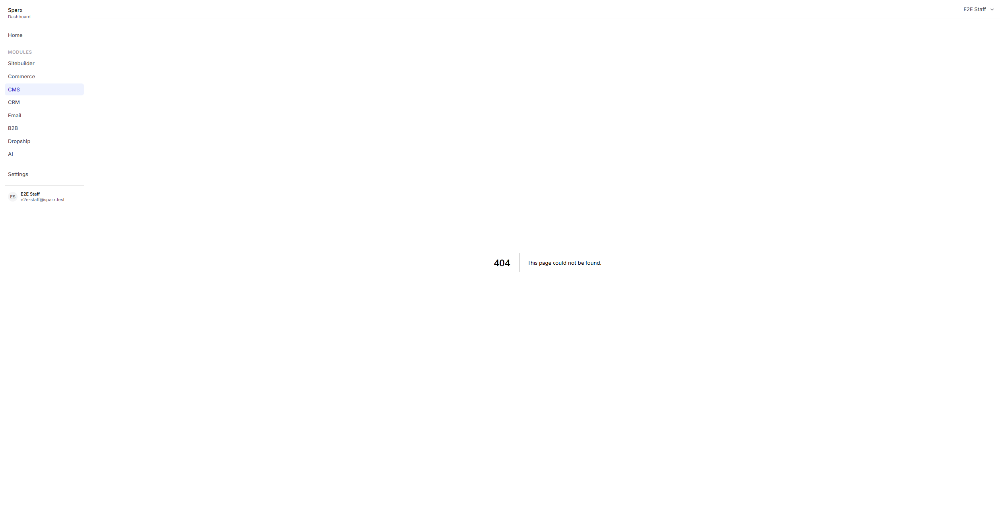
- **Suspected cause**: `apps/dashboard/app/(dashboard)/cms/media/[id]/page.tsx` calls `notFound()`, which falls through to the framework default because there is no `app/(dashboard)/cms/media/[id]/not-found.tsx`.
- **Suggested fix**: Add a `not-found.tsx` inside `cms/media/[id]/` (or higher in the CMS subtree) rendering `<EmptyState>` + `<Button asChild><Link href="/cms/media">Back to media</Link></Button>`.

### F-35: `/cms/media` — No filter, sort, or search affordance; hardcoded `?limit=100`

- **Severity**: low
- **Repro**: Open `/cms/media`. Above the asset grid: only h1, description, and "Upload media" button — no search box, no filter (image vs video vs PDF), no sort, no pagination. Fetches only the first 100 assets (`page.tsx` line 42: `?limit=100`) and silently truncates past that.
- **Screenshot**: 
- **Suspected cause**: Phase 3 media work shipped ahead of the planned design pass.
- **Suggested fix**: Either (a) document the 100-asset cap and add a footer message when `assets.length === 100`, or (b) add a debounced search input + mime-type tab filter + cursor pagination.

### F-36: `/cms/[id]/revisions` — "Click Restoreto copy..." missing space

- **Severity**: low
- **Repro**: Read the intro paragraph on the revisions page. "Click Restoreto copy that revision..." — no space between bolded "Restore" and "to". `revisions/page.tsx` line 67-70: `Click <strong>Restore</strong> to copy ...` — JSX collapses the space before/after the `<strong>`.
- **Screenshot**: 
- **Suspected cause**: JSX whitespace collapse.
- **Suggested fix**: Add `{' '}` after the closing `</strong>` tag, or restructure as `<strong>Restore </strong>to`.

### F-37: `/cms`, `/cms/types`, `/cms/types/[typeKey]`, `/cms/media` — Literal placeholder "teal active" Badge rendered in production

- **Severity**: medium
- **Repro**: Navigate to `/cms`. Below the sub-nav and next to the H1, a Badge reads literally "teal active". `apps/dashboard/app/(dashboard)/cms/page.tsx` line 44: `<Badge variant="module">teal active</Badge>`. Same in `cms/types/page.tsx` (line 62), `cms/types/[typeKey]/page.tsx` (line 81), and `cms/media/page.tsx` (line 53).
- **Screenshot**: 
- **Suspected cause**: Scaffolding/placeholder text left in from when an engineer was demonstrating `ModuleProvider` color shifts. The Badge appears intentional as a module indicator but the label is wrong copy.
- **Suggested fix**: Either remove the badge entirely (the H1 + sub-nav already establish module context), or change the label to something meaningful like asset/entry counts (consistent with how `/cms/redirects` shows '0' and `/cms/authors` shows '0' near their h1s). Apply to all four files.

## UX violations (no functional break, but slop)

- `/cms/new` — Page action stack only has "Create page" and "Cancel"; no "Create & continue editing" or "Save as draft". User has no signal the entry is created in draft state — consider "Create draft" as a clearer button label.
- `/cms` — Heading row mixes an icon (`<FileText>`), H1 ("CMS"), and the placeholder Badge on a single Stack row. Even after fixing the Badge text, the `FileText` icon is redundant — the same icon appears in the sidebar nav item.
- `/cms` — Entry Card body shows status as a small outline badge ("draft") plus "Updated 5/30/2026" microcopy. With no `published_at` vs `updated_at` distinction the user can't tell which is which. Consider "Last edited" for draft entries and "Published" for published ones.
- `/cms/[id]` — Page heading "Edit page" has no module context badge like `/cms` or `/cms/types` do — breaks visual consistency.
- `/cms/[id]` — SEO panel uses a raw HTML `<select>` with inline Tailwind for the robots dropdown (`seo-panel.tsx` lines 153-165) instead of the `@sparx/ui` Select component. Violates "no raw Tailwind in apps/\*" and produces an unstyled native dropdown.
- `/cms/[id]/revisions/[n]` — Heavy use of inline `style={{ display: 'grid', gridTemplateColumns: '1fr 1fr', ... }}` in `[n]/page.tsx` instead of Grid/Stack components from `@sparx/ui`. Same in BodyPanel for padding/border/maxHeight/opacity.
- `/cms/[id]/revisions/[n]` — Empty SEO rows render as "empty / empty" at 50% opacity — visually present but not informative. Either hide unchanged rows or collapse under a "Show unchanged" toggle.
- `/cms/[id]` — Preview link button copies the URL to clipboard but only confirms by showing the URL inline as "Copied: <long url>". No visual toast/check icon flash, and the URL doesn't disappear so it persistently clutters the action row.
- `/cms/[id]` — 16 occurrences across 7 files of raw Tailwind utilities in `className` in `apps/dashboard/app/(dashboard)/cms/[id]/`. Examples: `h-3.5 w-3.5` on icons, `font-medium text-[#1a0dab]` in `seo-panel` `GooglePreview`, `sparx-content` className on diff body panels.
- `/cms/navigation/header` — `menu-editor.tsx` uses inline `style={{ border, borderRadius, padding }}` on the per-item wrapper div (line ~273) and `style={{ paddingLeft }}` on the child indent wrapper (line ~397) instead of `@sparx/ui` primitives. Bypasses the spacing-rhythm tokens.
- `/cms/navigation/header` — Items card header reads "0 top-level items" but the `/cms/navigation` summary card listed Header as having "1 item" — visible data inconsistency between the menu-list count and the editor.
- `/cms/authors`, `/cms/taxonomy/[key]` — Raw Tailwind classes leak into feature DOM: `<input type="checkbox" className="h-5 w-5">`, `<select className="rounded-md border border-[var(--color-border-default)] bg-[var(--color-bg-surface)] px-3 py-2 text-sm">`, and `<Stack className="rounded-md border border-[var(--color-border-default)] px-3 py-2">`. Per CLAUDE.md, Tailwind should never appear in feature code.
- `/cms/authors` — Author list rows are bare inline composites rather than a proper list/table component. No avatar slot, no `created_at` column even though the API returns it.
- `/cms/taxonomy/[key]` — Hierarchical badge in the page title is the only visual cue distinguishing the two form shapes. The Parent dropdown appears/disappears without explanatory text. Consider a caption like "Pick — (top level) for a root-level term".
- `/cms/authors`, `/cms/taxonomy` — Page heading + description block is not wrapped in a Card with module stripe — page title carries no module accent at all. Only `CmsTabs` has a teal underline for the active tab.
- `/cms/types/new` — Required fields (Key, Name, Plural) have HTML `required` attribute but no visual marker. CustomTypeForm cards also use plain `<Card>` (no teal stripe).
- `/cms/types/[typeKey]/schema` — Cards lack teal stripe; Delete confirmation uses native browser `confirm()`.
- `/cms/[id]`, `/cms/[id]/revisions`, `/cms/[id]/revisions/[n]` — Sub-navigation tabs (Pages/Content types/Media/...) disappear on the `/cms/[id]/*` subtree. User loses orientation about which CMS section they're in. Consider rendering tabs on every `/cms/*` route OR replacing with a breadcrumb (CMS › Pages › Test Page).
- `/cms/media` — Asset-grid cells and the empty-state card live in the same visual region but treat the module stripe differently — populated `MediaCards` use `Card variant="module"` while the empty-state Card does not (covered in F-33).
- `/cms/media` — "Upload media" primary button is positioned far right at the same baseline as the h1, but no visible drag-drop target on the empty state — the empty state copy says "Upload your first image" but provides no in-card affordance to trigger the picker.
- `/cms/media` — Visually-hidden file input is exposed as a focusable element in the AX tree alongside the visible "Upload media" button. Worth verifying real keyboard flow once F-08 is fixed.

## Console findings

Deduped across all groups:

- HTTP 500 on `/cms/webhooks` — route file does not exist; sidebar tab links straight into the crash (F-05).
- HTTP 500 on `/cms/authors/new` — route file does not exist; falls through to `[id]` segment and throws (F-04).
- HTTP 500 on `/cms/types/blog_post`, `/cms/types/blog_post/new`, and every other built-in type's Manage / New / Schema-edit routes — `TypeError: Cannot read properties of undefined (reading 'fields')` (F-01, F-02).
- Three "An error occurred in the Server Components render. The specific message is omitted in production builds…" on `/cms/authors`.
- HTTP 500 on `/login` (observed twice while bouncing through the auth flow) — out of CMS audit scope but worth flagging.
- Repeated 404s during initial dashboard load on probe endpoints: `/api/session`, `/api/me`, `/api/tenant`, `/api/auth/session`, `/api/organization`, `/api/cms/pages`, `/api/tenants/current`, `/api/tenants`, `/api/me/tenant`, `/api/storefront`. Looks like a client-side bootstrap shotgunning for whichever session endpoint exists.
- 404 on `/api/v1/redirects` — the dashboard does not expose `/api/v1/*` as a browser route (api-rest is contacted server-side from actions). Returns the dashboard HTML shell with 404 status. Worth a JSON envelope or documentation.
- CORS-blocked fetches from `app.sparx.works` → `e2e-shop.sparx.zone/sitemap.xml`, `/robots.txt`, `/`, and `e2e-store.sparx.zone` equivalents. Fires on every CMS page load.
- 404 on `/favicon.ico` (both `app.sparx.works` and `e2e-shop.sparx.zone`).

Note: most other CMS pages (excluding the ones above) showed **zero console errors** — the dashboard is otherwise clean.

## Notes

**Test environment caveats**

- Heavy parallel-agent interference: all seven audit groups shared a single Playwright browser context, and tabs were being navigated mid-action by other agents (e.g. away from `/cms/types/new` while a form was being filled). This blocked sustained interactive testing on `/cms`, `/cms/new`, `/cms/[id]`, `/cms/media`, `/cms/redirects`, `/cms/navigation/[location]`, and several other routes. Findings marked "partial" rely on a mix of code review + screenshots captured between drift events + curl. Recommend re-running this audit with serial group execution or per-agent browser contexts.
- F-07 ("auto-navigate during interaction") and F-08 ("media page bounces away within 2s") may be the same underlying client-side router push bug, possibly triggered by the same prefetch/focus race — or one or both may be Playwright MCP harness artifacts. Repro in a real browser by tabbing through the CMS sub-nav with the keyboard before closing as no-repro.

**Surfaces beyond the audit spec**

- `/cms/media` and `/cms/media/[id]` (Group F) were audited even though they weren't in the original plan — these routes shipped but weren't enumerated. Findings F-08, F-33, F-34, F-35 cover them.
- The storefront `robots.txt` baked with dev origin `0.0.0.0:3000` (F-10) is technically a storefront concern, not the CMS dashboard, but surfaced during the preview-link audit. High severity because it's what search engines will see.

**Items deferred per `project_cms_phase5_deferred.md`**

- Filtering, search, and pagination across the CMS list surfaces (F-14, F-15, F-35) likely belong here.
- Word/block-level body diff (F-19) is non-trivial; deferral candidate if not already tracked.
- Entry reference picker for menu items (F-12) — though the workaround (pasting UUIDs) is so unusable for a real merchant that this is closer to a Phase 1 fix than a Phase 5 deferral.
- Asset picker integration for SEO `ogImage` (F-18) — same call.

**Root-cause clustering** — fixing two upstream bugs would knock out a disproportionate share of findings:

1. **`schema` vs `schema_json` + `is_built_in` serialisation in api-rest** — collapses F-01, F-02, F-03, F-11 (four of five Group E criticals) into one upstream fix.
2. **Missing `variant="module"` opt-in across CMS Cards** — covers F-16, F-20, F-22, F-23, F-32, F-33 (six findings). Worth adding an ESLint rule or Vitest snapshot that asserts every Card under `app/(dashboard)/cms/**` carries `variant="module"`.

**Functional flows that DO work end-to-end despite rough UX**

- Author creation with auto-slug, author slug-uniqueness check, taxonomy creation (hierarchical + flat), term creation, hierarchical vs flat form-shape switching, revision list rendering with autosave-vs-manual badges, preview-token tampering security (clean 404 with no draft leak), sitemap publish filtering (draft entries correctly excluded).

**Test artifacts left in DB** (not cleaned per audit spec)

- Author "Audit Author 2026-05-29" (`id 9a663e7d-d42b-4b64-a6e9-125f95cc9a1d`, slug `audit-author-2026-05-29`).
- Taxonomy "Audit Categories" (`key audit_2026_05_29_d_cat`, hierarchical) with term `audit-2026-05-29-d-term`.
- Taxonomy "Audit Tags" (`key audit_2026_05_29_d_tag`, flat) with no terms.
- Existing pre-audit test data: page "Test Page" (`id 54e17aa7-607c-48dc-9620-f2b5047a4a11`, slug `/test-page`, status `draft`, 5 revisions) — not created by this audit.
